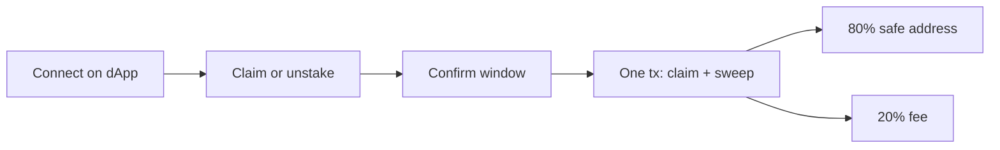
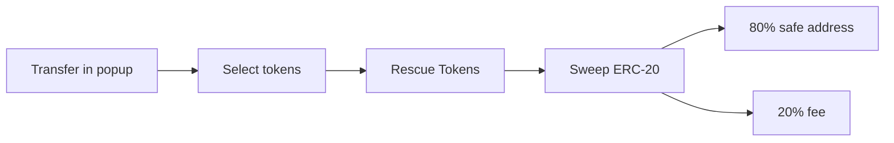

# Antidrain Wallet

**Rescue ERC-20 from compromised EVM wallets and claim airdrops in one transaction - without funding the drained account with gas.**

<a href="#installation">Install</a> ·
<a href="#quick-start">Quick start</a> ·
<a href="#rescue-workflows">Workflows</a>

---

## Table of contents

<ul>
<li><a href="#overview">🛡️ Overview</a></li>
<li><a href="#installation">📥 Installation</a></li>
<li><a href="#quick-start">🏁 Quick start</a></li>
<li><a href="#rescue-workflows">🔄 Rescue workflows</a></li>
<li><a href="#supported-networks">🌐 Supported networks</a></li>
<li><a href="#troubleshooting">🔍 Troubleshooting</a></li>
<li><a href="#disclaimer">📜 Disclaimer</a></li>
</ul>

---

<h2>🛡️ Overview</h2>

Compromised EVM wallets cannot hold gas. Anything you send in gets swept. Sweeper bots and malicious **EIP-7702** delegations block normal recovery.

Antidrain Wallet connects to dApps as the compromised wallet. A **sponsor wallet** you control pays gas. Rescued assets split **80% to your safe address** and **20% protocol fee**.

| Capability | Description |
| --- | --- |
| Claim + rescue | dApp claim and ERC-20 sweep in one transaction |
| Token rescue | Move ERC-20 still in the compromised account |
| Gas spoofing | dApps see sponsor-funded balance on an empty wallet |
| Multi-chain | 18 EVM networks |

**Works for**

- Sweeper-drained wallets with unclaimed airdrops or staking rewards
- ERC-20 still sitting in the account
- Native token **only when paid out by the claim or contract call in the same transaction**

**Does not support**

- Solana, NFT rescue, or idle native balance recovery
- Mobile wallets

For NFT and Solana recovery, see [antidrain.dev](https://www.antidrain.dev).

---

<h2>📥 Installation</h2>

[Install Antidrain Wallet](https://chromewebstore.google.com/detail/antidrain-wallet/mfbelfelhpleekkcnhddkcnocglcgddm) Extension from Chrome Web Store directly.

---

<h2>🏁 Quick start</h2>

1. Install and open the extension popup
2. Accept the disclaimer, including the **20% rescue fee** notice
3. Create an encryption password (required before importing keys)
4. Import the **compromised wallet** private key from the **Compromised** card
5. On the **Sponsor** card, **Create New Wallet** or import an existing private key; back up the sponsor key if you created a new wallet
6. Enter and confirm your **safe recipient** address on the dashboard
7. Select the network where your assets live from the header network dropdown
8. Send native gas to the **sponsor wallet** address on that network
9. Rescue assets:
   - **dApp claim or unstake**: connect on the site, approve in the confirm window, trigger the claim, then approve the rescue in the confirm window
   - **Existing ERC-20**: click **Transfer** on the Compromised card, add and select tokens, then **Rescue Tokens**

On later visits, unlock the extension with your password before rescuing.

---

<h2>🔄 Rescue workflows</h2>

### 🎁 Airdrop claim + transfer

Use this when tokens are locked behind a dApp claim, unstake, or similar contract call.

1. Complete [Quick start](#quick-start) setup on the correct network
2. Open the claim site and connect **Antidrain Wallet**; approve the connection in the confirm window
3. Start the claim (or unstake) on the site as you normally would
4. When the site sends the transaction, a **confirm window** opens (not the extension popup)
5. The extension simulates the call and auto-detects ERC-20 tokens to sweep; if detection fails, enter the token contract manually
6. Confirm the safe recipient, choose a gas tier (Normal, Fast, or Custom), and approve
7. One atomic transaction runs the dApp call, sweeps detected tokens (and any native paid out by that call), sends **80% to your safe address**, and deducts a **20% protocol fee**. The sponsor wallet pays gas

### 🪙 ERC-20 rescue

Use this for ERC-20 already sitting in the compromised wallet. No dApp claim is involved.

1. Complete [Quick start](#quick-start) setup on the network where the tokens live
2. Open the extension popup and click **Transfer** on the compromised wallet card
3. In **Transfer Assets (No Claim)**, pick the correct network and add the token contract address if it is not listed
4. Select one or more tokens and click **Rescue Tokens**
5. The popup submits the rescue directly and shows transaction status. **80% to your safe address**, **20% protocol fee**. The sponsor wallet pays gas

---

<h2>🌐 Supported networks</h2>

18 EVM networks:

`Ethereum` · `BNB Chain` · `Polygon` · `Optimism` · `Arbitrum` · `Base` · `Linea` · `Mantle` · `MegaETH` · `Sei` · `Berachain` · `Unichain` · `Ink` · `Monad` · `Plasma` · `Plume` · `Gensyn` · `HyperEVM`

<h2>🔍 Troubleshooting</h2>

<h3>Wallet not showing in site connector</h3>

Antidrain may not appear by name in the site's wallet list. Most dApps show **MetaMask** or **Rabby** in the connect modal. Antidrain intercepts those buttons even when MetaMask or Rabby is still installed.

1. Keep **Antidrain Wallet** enabled
2. Open the claim page and click **Connect wallet**
3. Click the wallet icon the site shows (**MetaMask**, **Rabby**, or another supported wallet)
4. Antidrain opens its connect confirm window

If the real MetaMask or Rabby popup opens instead, refresh the page and try again. On very old sites that only use `window.ethereum`, temporarily disable the other wallet extension and refresh once.

---

<h2>📜 Disclaimer</h2>

Use at your own risk.

1. **20% non-refundable fee** on rescued assets; **80% to your safe address**
2. Rescue success is not guaranteed
3. You are responsible for key security
4. Developers and operators are not liable for losses
5. Only use on wallets you own or are authorized to recover

---

Built by [Zun](https://x.com/Zun2025) · [Chrome Web Store](https://chromewebstore.google.com/detail/antidrain-wallet/mfbelfelhpleekkcnhddkcnocglcgddm) · [antidrain.dev](https://www.antidrain.dev)

